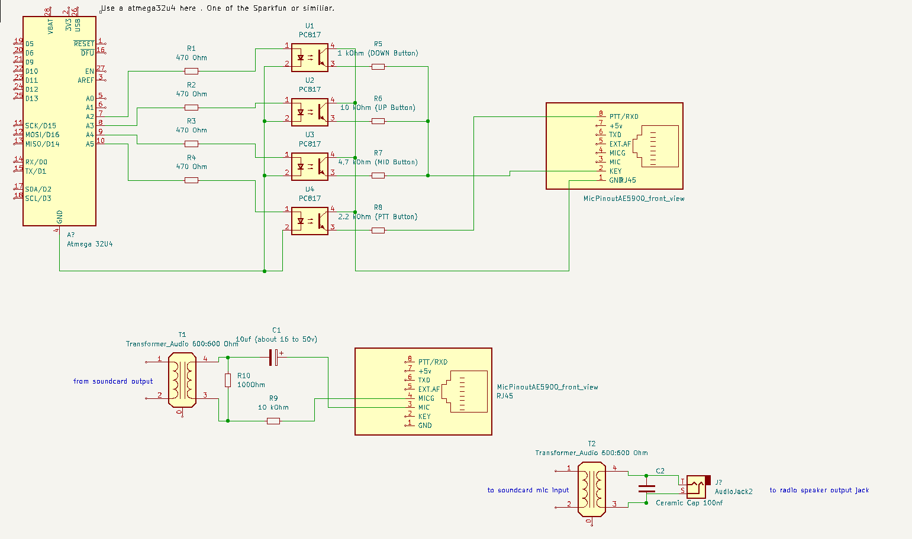
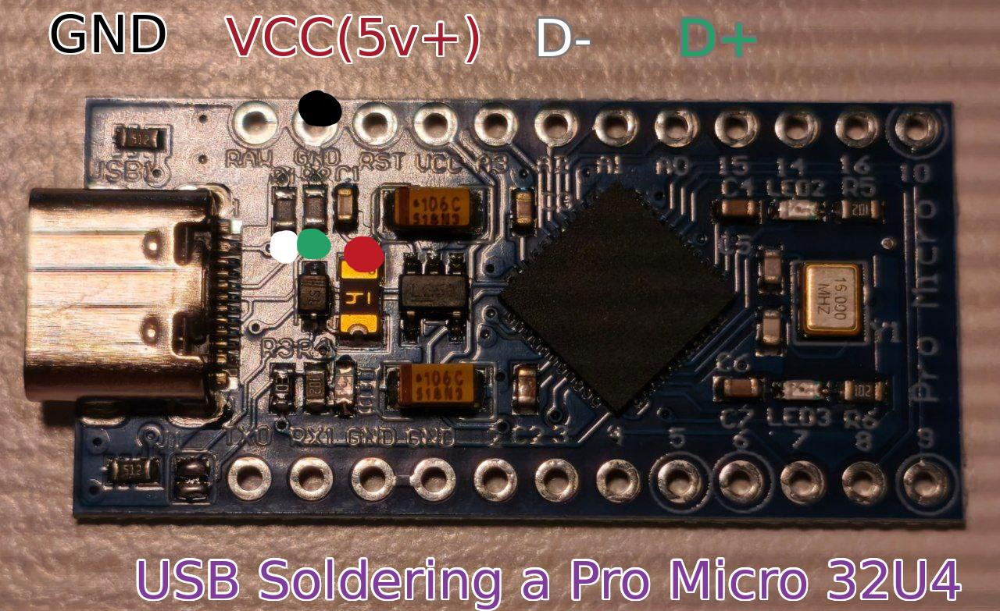
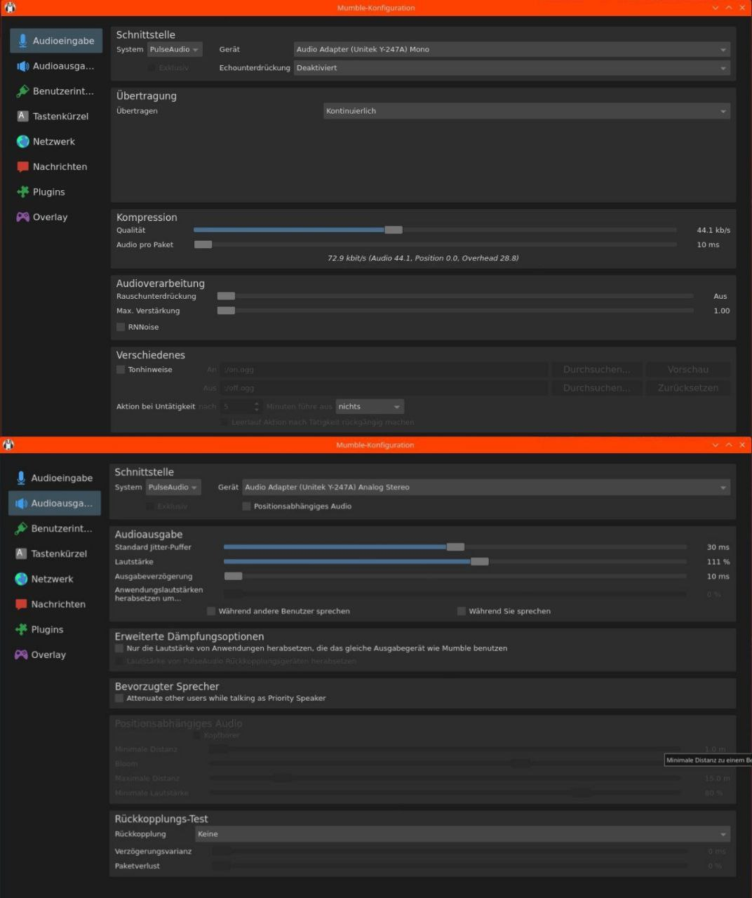
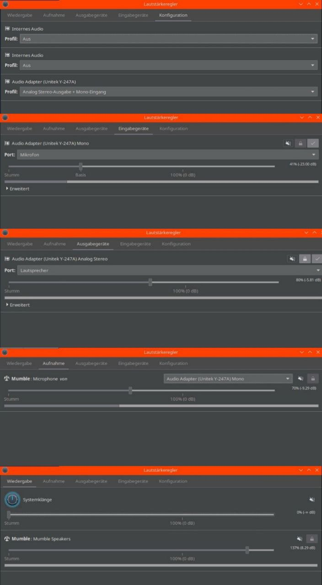

A simple LAN / WEB Albrecht AE-5900 remote rig control by web browser
=======================================================

## Main purpose of the project:

You better use the version V2: https://github.com/ThatCrazyDcGuy/AE5900_Remote_V2

Build a simple LAN / WEB remote control for the amazing Albrecht AE-5900 and similiar CB and HAM Radios.
It is far away from a rigctl or hamlib but hey, it works.

The simple idea is, to emulate the 3 button (4 include PTT) Mic and publish the control of these buttons to a flask / python over network / web.
In my case i set the middle button of my AE5900 to Mode (modulation).
So i can CH Up / CH Down / Mode and PTT my device from everywere.
For audio i just use a usb Soundcard, some components and mumble on my raspberry and my phone.

To be clear: That will work on most cb-radios which are controlled by buttons available on microphone.
It is just tested on the Albrecht AE5900. If you don't know the radio: https://www.alan-electronics.de/product-details.aspx?WPParams=50C9D4C6C5D2E6BDA5A98494A895
I got my AE5900 from https://gmw-funktechnik.ch/ which is a amazing classic CB / HAM store.

## A picture will say more than your wife

- From first testing to put all the stuff in to a small case

	

## About & Why

The Albrecht AE-5900 is the fantastic new (2026) FM/AM/SSB/CW Radio i did not expect. It has a huge potential to have fun with it and brings me back to CB after 35 years of silence. 

So, i build something additional for it and someone (yeah, thanks again bro) told me to publish it on github and i said hmmmkay.
The device i build is based on an Pro Micro atmega32u4, a cheap usb soundcard, a usb hub breakout board, coils, resistors, capacitors, optocouplers and some stuff i had around in my scrapbox. It is working well and i've fun with it.
Let's see what will happen in next days.

But Why:

It is the hobby you will not have enough time for.
Especially if you are a old guy with kids, garden, one or more jobs and all that surprises life will have for you. So now it is possible to use your home station, with your perfect build of an antenna from your workingpaces toilet or whatever.

Thats just why.

## How it works:

Plug the remote device in to a raspberry or something else that will run the python script. Also your ae5900 mic plug and speaker output should be connected.
Start mumble on your host / you might have to crossover Input and Output.
Run the python3 app.py
Browse your localhost:5000.
Pull down the setup part.
Set your ae5900 to use the middlebutton of mic TYPE1 to MODE.
Set your ae5900 manually, on radio to CH1 and Mode PA.
Press the sync button in websetup menu for 3 sec.
Now change, on web page, first the modulation as desired and then switch the chanels.
Start mumble on your remote device and have fun.
Had good Audio-feedbacks on some QSO's

Thats all.

## Building

The hardware in detail.
i'm not so much familiar with KiCad, normally i do not plan my projects and write them down. I just do and it works somehow. I this case, just for you, because some people asking, i tried to show a shematic here:

- Shematic overview in detail

	

The Atmega32U4 i used is a Pro Micro, often from SpakFun or similiar brands.
In my case i used pin 2 - 5. You can see at the bottom of the picture TX0 RX1 GND GND  (2 3 4 5 6 7.....) <- thats wehre we connect the resistors and optocouplers.
On following Picture i marked the points wehre you can solder an USB port if you're not a fan of lot of plugs in your projects.

- Pro Micro with 32U4 chip (this one is my favorite: https://www.sparkfun.com/pro-micro-5v-16mhz.html#)

	

### Software needed

- just for bulding

Arduino IDE neded to flash/upload the Sketch (.ino file) to Pro Micro 32U4 Get Arduno IDE here: https://docs.arduino.cc/software/ide-v2/tutorials/getting-started/ide-v2-downloading-and-installing/
(Some librarys needed. I will list them later.)

- to make the device useable

Mumble & Mumble Server for your voice i/o on the computer/raspberry that will host your remote control

	# sudo apt install mumble mumble-server
	
Mumble on your remotecomputer or Mumla on your Android phone.

Tailscale on host and remote, for use your device from all over the world. :)

	# curl -fsSL https://tailscale.com/install.sh | sh

In best case you have already pipewire or pulseaudio preinstalled on your host system.
Otherwise just install all of that stuff.

In my case i use pipewire and some custom configs to get a clear audio without the autogain trash.
If you want to have the same as me:

	# sudo apt install python3-serial python3-flask python3-time
	# sudo apt install pipewire pipewire-audio pipewire-alsa pipewire-pulse pipewire pipewire-audio-client-libraries pavucontrol wireplumber libpipewire-0.3-modules ladspa-sdk swh-plugins dbus-user-session 
	# sudo apt remove pipewire-media-session

My custom configs looks like this (use nano, vi or mcedit):

The custom config for the radio optimized rate:

	# mcedit ~/.config/pipewire/pipewire.conf.d/custom.conf
	
And add:

	
	context.properties = {
    default.clock.rate = 48000
    default.clock.allowed-rates = [ 44100 48000 88200 96000 ]
	}

The autogain part:

	# mcedit ~/.config/pipewire/pipewire-pulse.conf.d/99-disable-autogain.conf

And add:

	  
	 pulse.rules = [
    {
        matches = [
            { application.process.binary = "mumble" }
            { application.process.binary = "mumble-worker" }
        ]
        actions = { quirks = [ block-source-volume ] }
    }
	]

The autoscale part:

	# mcedit ~/.config/pipewire/pipewire-pulse.conf.d/block-autoscale.conf

And add:

	
	pulse.rules = [ { matches = [ { application.process.binary = "mumble" } ]; actions = { quirks = [ block-source-volume ] } } ]

You might have a look:

- Just a view on my audio settings (mumble and pavucontrol)
You have to think reverse here. Input is Output and reverse.

	
	

## Run and have fun

If the hardware is build, all the settings are done and the Pro Micro 32U4 flashed, then;

	# git clone https://github.com/ThatCrazyDcGuy/AE-5900_Remote_v1
	# python3 ~/AE-5900_Remote_v1/webinterface/app.py	

It might be a good idea to run a websdr at home. I do so. Not only for check if you are on the correct chanel and mode, also for checking audio. You will also be able to see whats happen all over the chanels.
A good websdr is easely build with openwebrx, a raspberry, a rtl-sdr dongle (like RTL-SDR Blog V3 or v4 / nooelec nesdr v5)  and an antenna.
Just have a look at OpenwebrxPlus: https://luarvique.github.io/ppa/ RTL-SDR Blog v4: https://www.rtl-sdr.com/v4/ 

## What you can expect more:

Nothing more than my experience.
I will not support you personaly.
But i will upload some scripts, pictures and ideas to share with people.

I'm not a coder, but i can read what someone has written, i can understand and implement in my projects.

## Whats happen here last days:

10/Mar/2026:
1. Opened github repo.
2. Added a picture of the stuff i build.
3. I put some infos in the readme.

11/Mar/2026:

1. Uploaded lot of informations, pictures,"shematics", the scripts (cleaned by googles AI).
It looks like chaos and yes, it is. Give me some time.
2. Project was linked on https://freie-funker-hochrhein.jimdofree.com

12/Mar/2026:

1. Chill!
2. Make and edit some pictures for documentation - future uploads will follow.
3. Testing the device heavier to find problems.
4. Editing this readme and get a structure.
5. Lot of Test-QSO's - amazig feedbacks came in.

13/Mar/2026

1. Had a coffe.
2. Might i solved the slow key reaction - testing is ongoing.
3. Editing this readme.
4. Got amazing DX SSB audio feedback Switzerland to Charlottesville USA.
5. The project was linked on https://simonthewizard.com/2026/03/13/new-albrecht-ae-5900-simple-remote/

14/Mar/2026to 15/Mar/2026

1. Garden was calling. Ok, it was my wife calling "there is lot of work in the garden". But anyway, i had no time for the project.
2. I found a short time frame, wife was busy with wife-stuff, to get my antenna 6m higher.

16/Mar/2026

1. Work is ongoing.
2. Still writing readme and documentation...
3. Short Telegram update.

17/Mar/2026

1. Adding more infos.
2. Got fantastic audio feedback at "Argovia Runde" which is a group in switzerland, having QSO on CH13 USB every tuesday, 19:00 CET.

18/Mar/2026

1.	Adding more info and links of interest here.
2.	Had to urgently fixture my telescopic pole.

19/Mar/2026

1. Still looking and testing for a better keep alive part in script which is not slowing down the buttons pressed.

20/Mar/2026 to we/will/see

1. Wife had some ideas in gardening. You know who is on it then.
