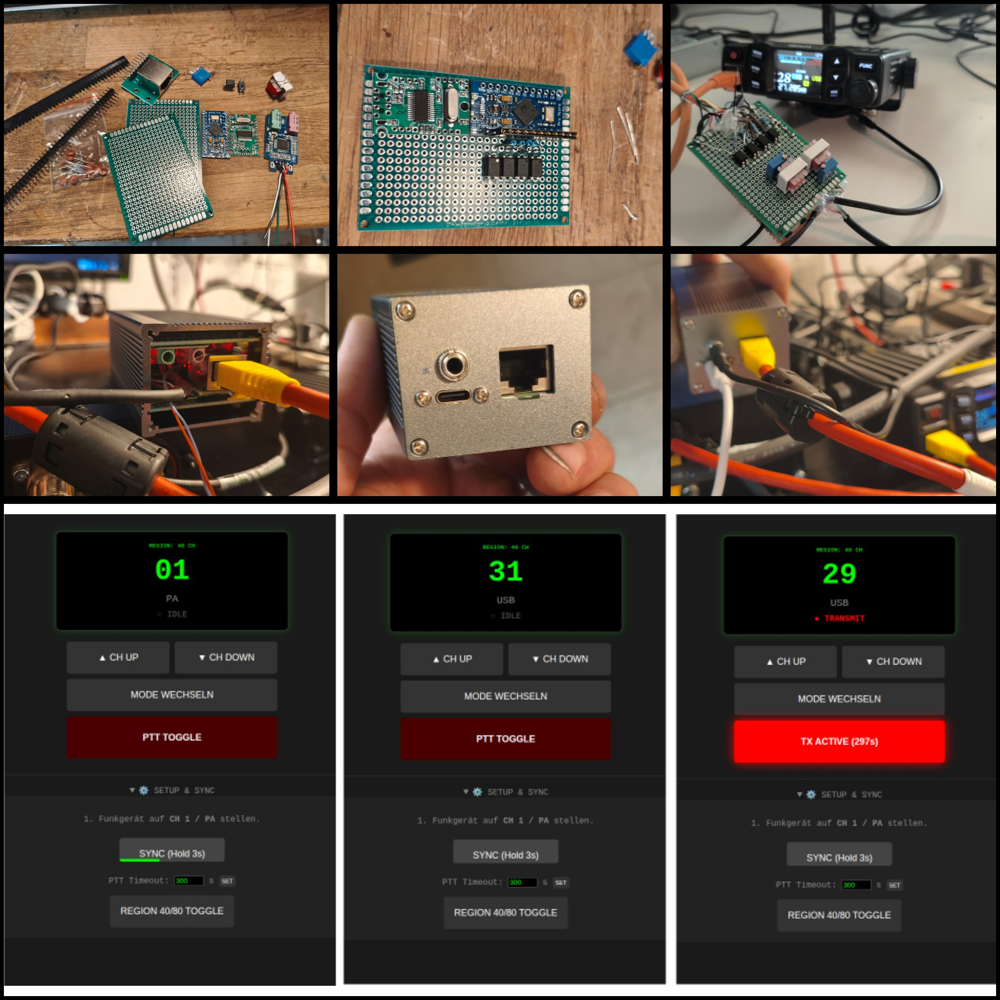

A simple LAN\WEB Albrecht AE-5900 remote control
=================================================

## Main purpose of the project:

Build a simple LAN\WEB remote control for the amazing Albrecht AE-5900 and similiar Radios

The simple idea is, to emulate the 3 button (4 include PTT) Mic and publish the control of these buttons to a flask / python over network / web.
In my case i set the middle button of my AE5900 to Mode (modulation).
So i can CH Up / CH Down / Mode and PTT my device from everywere.
For audio i just use a usb Soundcard, some components and mumble on my raspberry and my phone.

## A picture will say more than your wife

- From first testing to put all the stuff in to a small case

	

## About & Why

The Albrecht AE-5900 is the fantastic new (2026) FM/AM/SSB/CW Radio i did not expect. It has a huge potential to have fun with it and brings me back to CB after 35 years of silence. 

So, i build something additional for it and someone (yeah, thanks again bro) told me to publish it on github and i said hmmmkay.
The device i build is based on an Pro Micro atmega32u4, a cheap usb soundcard, a usb hub breakout board, coils, resistors, capacitors, optocouplers and some stuff i had around in my scrapbox. It is working well and i've fun with it.
Let's see what will happen in next days.

But Why:

It is the hobby you will not have enough time for.
Especially if you are a old guy with kids and all that surprises life will have for you. So now it is possible to use your home station, with your perfect antenna from your workingpaces toilet or whatever.

Thats just why.

## How it works:

Plug the remote device in to a raspi or somehing else that will run the python script. And also your ae5900 mic plug and speaker output should be connected.
Start mumble on your host / You migt have to crossover Input and Output.
run the python3 app.py
browse your localhost:5000
Pull down the setup part
Set your ae5900 to use the middlebutton of mic TYPE1 to MODE
Set your ae5900 manually to CH1 and Mode PA
Press the sync button in websetup menu for 3 sec
Now change, on web page, first the modulation as desired and then switch the chanels.
Start mumble on your remote device and have fun.
Had good Audio-feedbacks on some QSO's

Thats all.

## Building

The hardware in detail:
- will follow soon

### Software needed
	# will follow soon

## What you can expect:

Nothing more than my experience.
I will not support you personaly.
But i will upload some scripts, pictures and ideas to share with people.

I'm not a coder, but i can read what someone has written, i can understand and implement in my projects.

## Whats happen here:

10/Mar/2026:
1. Opened github repo
2. Added a picture of the stuff i build.
3. I put some infos in the readme

11/Mar/2026:

1. Uploaded lot of informations, pictures,"shematics", the scripts (cleaned by googles ki)
It looks like chaos and yes, it is. Give me some time.
